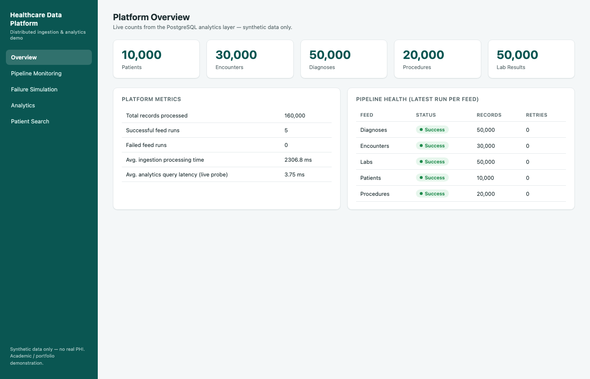
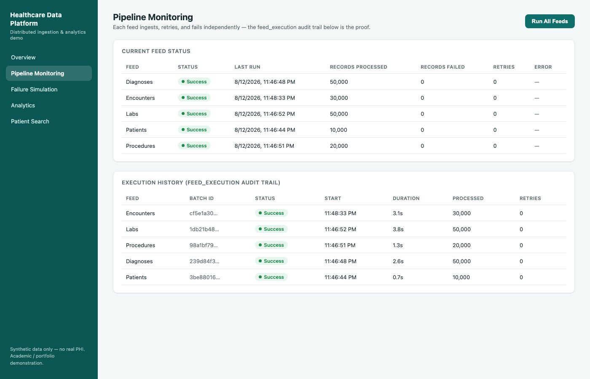
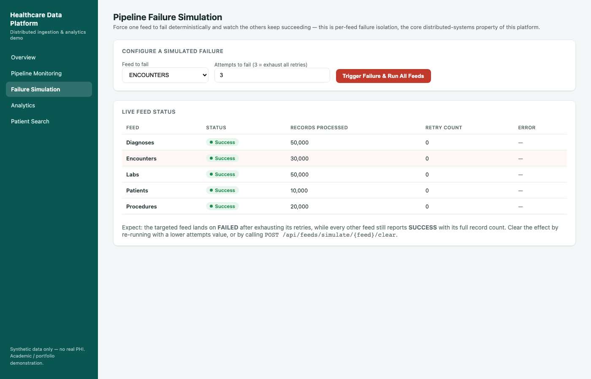
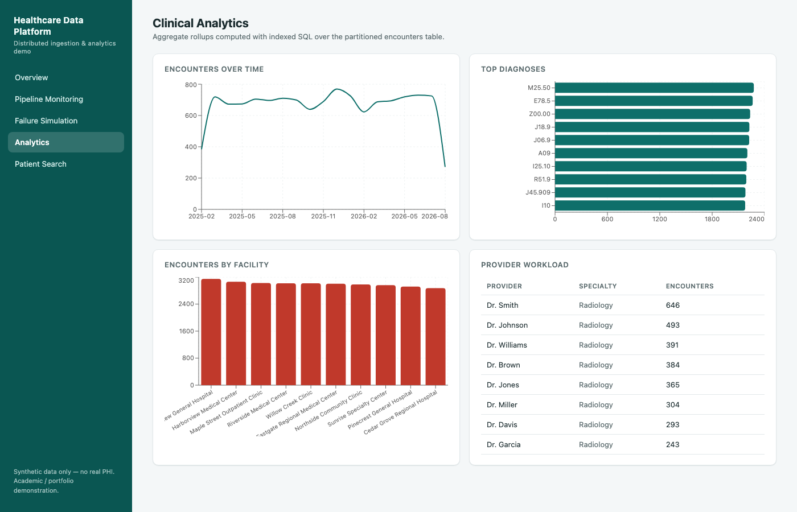

# Distributed Healthcare Data Platform

A fault-tolerant, multi-feed healthcare data ingestion and analytics
platform: independent retry/failure-isolation per feed, a raw landing
zone, a partitioned + indexed PostgreSQL analytics layer, a Spring Boot
REST API, and a React dashboard — including a live failure-simulation
panel.

**Academic / portfolio project. Runs entirely locally at $0 required
infrastructure cost — no Docker, no cloud subscription.** Azure Data
Factory and Azure Blob Storage are represented as the production target
architecture (design artifacts under [`azure-adf/`](azure-adf)), not a
runtime dependency.

> **No real patient data is used anywhere in this project.** All data is
> synthetically generated by [`data-generator/`](data-generator). This is
> a demonstration platform, not a clinical system.

---

## Why this project exists

Healthcare systems receive data from many independent upstream sources —
patient registration, encounters, diagnoses, procedures, lab systems —
each on its own schedule, each capable of failing independently. A naive
ingestion job that processes every feed in one pass turns a single bad
file into a platform-wide outage. This project demonstrates the
alternative: **per-feed failure isolation** — proven with an automated
test, an integration test against a real database, and a live dashboard
demo.

## Screenshots

| Overview | Pipeline Monitoring |
|---|---|
|  |  |

| Failure Simulation | Clinical Analytics |
|---|---|
|  |  |

Full write-up with the live GitHub Pages showcase: [`github-pages/index.html`](github-pages/index.html).

## Architecture

```
5 Upstream Feeds  →  Retry + Per-Feed Isolation  →  Raw Landing Zone
(Patients,            (Azure Data Factory design /   (local filesystem ⇄
 Encounters,            local Java engine, running)   Azure Blob Storage)
 Diagnoses,                                                    │
 Procedures, Labs)                                             ▼
                                                       Validation & Transform
                                                                │
                                                                ▼
                                                       PostgreSQL Analytics
                                                       (partitioned + indexed)
                                                                │
                                                                ▼
                                                       Spring Boot REST API
                                                                │
                                                                ▼
                                                       React Dashboard
```

Details: [`docs/architecture.md`](docs/architecture.md) · [`docs/data-pipeline.md`](docs/data-pipeline.md)

## Fault tolerance — the core distributed-systems concept

Captured from a real run (dashboard's Failure Simulation panel, forcing
the Encounters feed to fail through all retry attempts):

```
Patients    SUCCESS   10,000 processed   0 retries
Encounters  FAILED         0 processed   2 retries
Diagnoses   SUCCESS   50,000 processed   0 retries
Procedures  SUCCESS   20,000 processed   0 retries
Labs        SUCCESS   50,000 processed   0 retries
```

Proven three ways: a pure unit test, an integration test against a real
PostgreSQL database, and the live demo above. Details:
[`docs/fault-tolerance.md`](docs/fault-tolerance.md).

## Measured database performance

Partitioning (`encounters`, by `encounter_date`, yearly) + targeted
indexing, benchmarked against an unpartitioned/unindexed baseline loaded
with identical data:

| Query | Baseline | Optimized | Improvement |
|---|---|---|---|
| Patient encounter history | 2.443 ms | 0.105 ms | **95.7%** |
| Encounters by facility (date-range) | 4.151 ms | 2.835 ms | **31.7%** |
| Diagnoses by patient | 4.820 ms | 0.099 ms | **97.9%** |
| **Average** | | | **75.1%** |

Real, reproducible numbers — not assumed, and not stable between runs
(an earlier run measured 84.7% average on the identical queries; see
why in the docs). Methodology, raw samples, and an honest discussion of
why this differs from the commonly-cited "~30%" figure — and why the one
query that does real aggregation work landed almost exactly on that
figure while the two point-lookup queries did far better — in
[`docs/performance.md`](docs/performance.md).

## Tech stack

| Layer | Technology |
|---|---|
| Backend | Java 21, Spring Boot 3, Spring Data JPA, Flyway, Maven |
| Database | PostgreSQL 16 (partitioned + indexed) |
| Frontend | React 18, TypeScript, Vite, Recharts |
| Data generation | Python 3, Faker |
| CI | GitHub Actions (build + test; no Docker) |
| Cloud target (design only) | Azure Data Factory, Azure Blob Storage |

## Repository structure

```
distributed-healthcare-system/
├── backend/           Spring Boot application
├── frontend/          React + TypeScript dashboard
├── data-generator/    Python synthetic data generator
├── data/              generated/ (gitignored, regenerate) + sample/ (small, committed)
├── database/          migration mirror + benchmark SQL
├── azure-adf/         design-only Azure Data Factory pipeline definitions
├── docs/              architecture, pipeline, database, fault-tolerance, performance, api, testing, deployment
├── reports/performance/  benchmark runner + measured results.json
├── github-pages/      technical showcase site
└── .github/workflows/ CI + Pages deploy
```

---

## Run the demo

### Prerequisites (all free, all local)

- Java 21 (e.g. `brew install openjdk@21`)
- Maven (`brew install maven`)
- PostgreSQL 16 (`brew install postgresql@16`)
- Python 3.10+ (for the data generator)
- Node.js 20+ (for the frontend)

### 1. Database

```bash
brew services start postgresql@16
createdb healthcare
psql -d postgres -c "ALTER DATABASE healthcare OWNER TO healthcare;" # or your preferred role
```

(Flyway creates all schemas/tables automatically on first backend
startup — see `backend/src/main/resources/db/migration/`.)

### 2. Generate synthetic data

```bash
cd data-generator
python3 -m venv .venv && source .venv/bin/activate
pip install -r requirements.txt
python generate_data.py --patients 10000 --encounters 30000 \
  --diagnoses 50000 --procedures 20000 --labs 50000 --seed 42
```

### 3. Backend

```bash
cd backend
mvn spring-boot:run
```

Then trigger ingestion of all 5 feeds:

```bash
curl -X POST http://localhost:8080/api/ingestion/run
```

Or one feed at a time (synchronous, returns the result immediately):

```bash
for f in PATIENTS ENCOUNTERS DIAGNOSES PROCEDURES LABS; do
  curl -X POST http://localhost:8080/api/ingestion/run/$f
done
```

### 4. Frontend

```bash
cd frontend
npm install
npm run dev
```

Open **http://localhost:3000**.

### 5. Try the failure demo

From the dashboard's "Failure Simulation" page, pick a feed (e.g.
Encounters), set attempts-to-fail to 3, and trigger it — watch that feed
land on `FAILED` while every other feed still reports `SUCCESS`.

## API

Full reference: [`docs/api.md`](docs/api.md). Quick examples:

```bash
curl http://localhost:8080/api/analytics/overview
curl http://localhost:8080/api/patients/PAT-0000001/encounters
curl http://localhost:8080/api/feeds/status
```

## Testing

```bash
createdb healthcare_test   # one-time
cd backend
mvn test
```

21 tests (unit + one integration test against real Postgres), all
passing. No Docker/Testcontainers. Details: [`docs/testing.md`](docs/testing.md).

## Documentation

- [`docs/architecture.md`](docs/architecture.md)
- [`docs/data-pipeline.md`](docs/data-pipeline.md)
- [`docs/database-design.md`](docs/database-design.md)
- [`docs/fault-tolerance.md`](docs/fault-tolerance.md)
- [`docs/performance.md`](docs/performance.md)
- [`docs/api.md`](docs/api.md)
- [`docs/testing.md`](docs/testing.md)
- [`docs/deployment.md`](docs/deployment.md)
- [`docs/data-sources.md`](docs/data-sources.md) — dataset strategy, why synthetic
- [`docs/requirements.md`](docs/requirements.md)
- [`docs/academic-report-outline.md`](docs/academic-report-outline.md) — structure for a written report

## Limitations

Documented honestly, not glossed over:

- **Synthetic data distributions are not epidemiologically realistic** —
  lab values and diagnosis frequencies are drawn from simple
  uniform/random distributions, not real clinical population statistics.
- **Provider isn't a stable joined entity.** To keep the ingestion model
  to exactly 5 feeds, `provider_name`/`specialty` are independently
  random per encounter row rather than tied to a consistent provider
  roster — so the same provider name can appear with different
  specialties across encounters. A `providers` feed/table would fix
  this; it was deliberately left out to keep the academic scope to 5
  feeds (see [`docs/database-design.md`](docs/database-design.md)).
- **No authentication/authorization layer.** Out of scope for this
  academic implementation — see the Security notes below.
- **The Azure integration is design-only.** `AzureBlobStorageGateway`
  and the ADF pipeline JSON are real, but have not been exercised
  against a live Azure subscription — see
  [`docs/deployment.md`](docs/deployment.md).
- **Performance numbers are measured at a modest data volume** (160,000
  rows) — see [`docs/performance.md`](docs/performance.md) for the
  honest discussion of how that affects the measured percentages.

## Security notes

- No credentials committed; `.env.example` documents required variables.
- CORS restricted to configured origins.
- All queries use JPA/parameterized SQL — no string-concatenated SQL.
- Bean Validation on inbound DTOs; centralized exception handling never
  leaks stack traces to API responses.
- Patient names/DOBs are never written to application logs — only
  surrogate IDs.

## Cost

**$0.** Every component (Java, PostgreSQL, Python, Node.js, the local
filesystem raw landing zone) is a free local install. Azure references
throughout this repo are explicitly marked as design/target
architecture, never a runtime requirement — see
[`docs/architecture.md`](docs/architecture.md#whats-design-only-vs-what-actually-running).